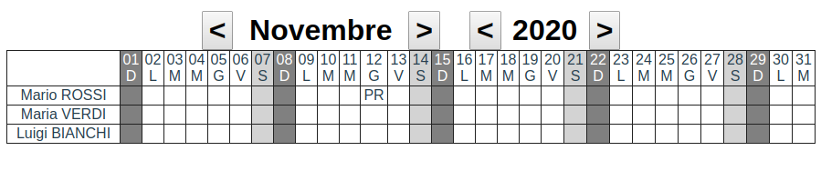

# Sviluppo di componenti per Vue.js

## [1] TabellaMese

Componente Vue che mostra una tabella temporale dinamica delle attività di tipo mensile.

<pre><code>
&lt;tabella-mese mese="11" anno="2020" 
    righe=" `Mario ROSSI` ,`Maria VERDI` ,`Luigi BIANCHI`"
    note="`Mario ROSSI` `12-11-2020` `PR`, `Luigi BIANCHI` `01-10-2020` `AS`">
&lt;/tabella-mese>
</code></pre>