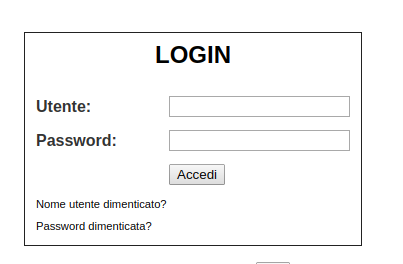

# Sviluppo di componenti per Vue.js

## [1] TabellaMese

Componente Vue che mostra una tabella temporale dinamica delle attività di tipo mensile.

<pre><code>
&lt;tabella-mese mese="11" anno="2020" 
    righe=" `Mario ROSSI` ,`Maria VERDI` ,`Luigi BIANCHI`"
    note="`Mario ROSSI` `12-11-2020` `PR`, `Luigi BIANCHI` `01-10-2020` `AS`">
&lt;/tabella-mese>
</code></pre>

## [2] Login

Form di tipo login.

<pre><code>
&lt;login hostServer="http://localhost:8080/">&lt;/login>
</code></pre>

## [3] Tabella

Componente Vue che mostra una tabella su cui può essere applicato un ordinamento o un filtro per colonna. All'interno di ogni celle è possibile anche inserito codice HTML.

<pre><code>
&lt;tabella   colonne="`CAP`,`Città`,                `Prov.`,  `Regione` "
              righe="`80100` `&lt;b>NAPOLI&lt;/b>`          `NA`     `CAMPANIA` , 
                     `81100` `CASERTA`                `CE`     `CAMPANIA` ,
                     `81024` `MADDALONI`              `CE`     `CAMPANIA` ,
                     `80053` `CASTELLAMARE DI STABIA` `NA`     `CAMPANIA`  ,
                     `32020` `LENTIANI`               `BL`     `VENETO` ,
                     `90049` `CITTA' DELLA PIEVE`     `PG`     `UMBRIA` ,
                     `89022` `CITTANOVA`              `RC`     `CALABRIA`,
                     `00120` `CITTA' DEL VATICANO`    `SCV`    `STATO VATICANO`, 
                     `13046` `LIVORNO FERRARIS`       `VC`     `PIEMONTE`, 
                     `00100` `&lt;b>ROMA&lt;/b>`            `RM`     `LAZIO`, 
                     `46040` `CASALROMANO`            `MN`     `LOMBARDIA`, 
                     `20100` `&lt;b>MILANO&lt;/b>`          `MI`     `LOMBARDIA`"
>&lt;/tabella>
</code></pre>

## [4] Diagramma

Componente Vue che mostra un diagramma XY di una funzione matematica [ y=f(x) ]
<pre><code>
&lt;diagramma funzione="x*x*x-3*x-1/2" altezza="550" lunghezza="750" unita="90">&lt;/diagramma>

</code></pre>